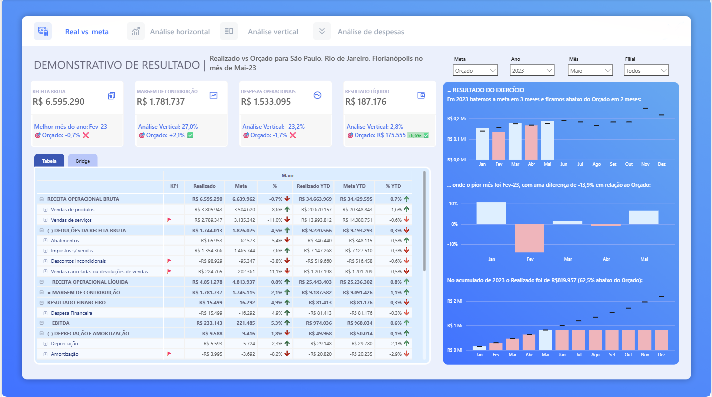

# 📊 Dashboard DRE – Realizado x Meta | Power BI

> Dashboard desenvolvido em Power BI para análise do Demonstrativo de Resultado do Exercício (DRE), utilizando DAX, Power Query e Modelagem de Dados.

---

## 📌 Sobre o projeto

Este projeto consiste no desenvolvimento de um dashboard de **Demonstrativo de Resultado do Exercício (DRE)** no **Power BI**, com foco na comparação entre o **Realizado** e os cenários de **Orçado** e **Previsto**.

O objetivo é fornecer uma visão executiva do desempenho financeiro por meio de indicadores, gráficos e análises interativas que auxiliam na tomada de decisão.

---

## 🎯 Objetivo

Desenvolver um dashboard financeiro aplicando boas práticas de Business Intelligence, modelagem de dados e criação de indicadores utilizando Power BI.

---

## 🚀 Funcionalidades

- Comparativo entre **Realizado x Orçado**
- Comparativo entre **Realizado x Previsto**
- KPIs financeiros
- Storytelling com títulos dinâmicos
- Segmentações por Ano, Mês, Filial e Meta
- Navegação entre as visualizações **Tabela** e **Bridge**

---

## 🛠 Tecnologias utilizadas

- Power BI
- Power Query (M)
- DAX
- Modelagem de Dados (Star Schema)

---

## 📚 Conceitos aplicados

- Modelagem Dimensional (Star Schema)
- Transformação de dados com Power Query
- Criação de medidas DAX
- Contexto de Filtro
- Contexto de Linha
- Utilização de VAR
- KPIs
- Storytelling com Dados
- Design de Dashboard Executivo
- Navegação com Bookmarks e Botões

---

## 📈 Medidas DAX desenvolvidas

Durante o projeto foram desenvolvidas medidas para cálculo de indicadores financeiros, comparação entre realizado e metas, variações, percentuais e títulos dinâmicos, aplicando conceitos fundamentais de DAX para construção de dashboards executivos.

---

## 🖼 Dashboard

*Adicione aqui uma imagem do dashboard.*

---

## 💡 Aprendizados

Este projeto permitiu aprofundar conhecimentos em modelagem de dados, Power Query, criação de medidas DAX, construção de KPIs e desenvolvimento de dashboards voltados para análise financeira e apoio à tomada de decisão.

---

## 📖 Contexto

Projeto desenvolvido como **case prático durante a formação em Power BI da Xperiun**, com finalidade exclusivamente educacional.
